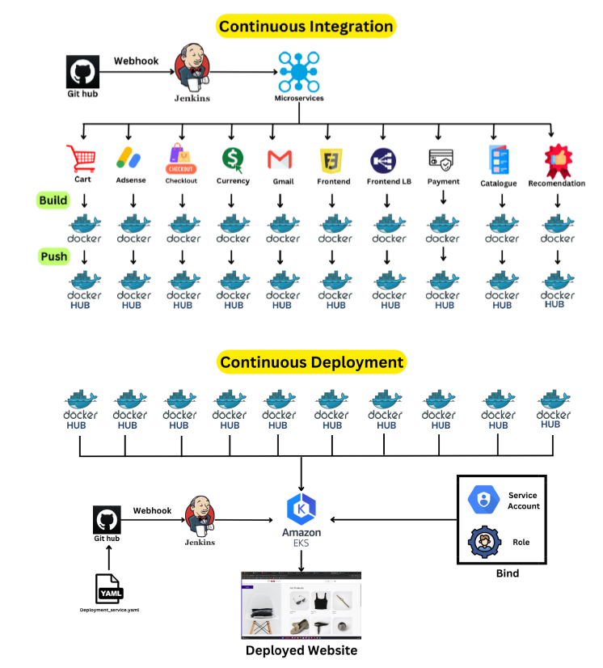

# MICROSERVICE CI/CD PIPELINE (E-COMMERCE WEBSITE)

    

## Project Overview
    - Project name:  Microservice CI/CD pipeline
    - Deployent Platform: AWS EKS (Elastic Kubernetes Service)
    - Application type: E-commerce website

## Microservices Overview
### Microservices Implemented:
    1. Ad Sense Service
    2. Cart Service
    3. Checkout Service
    4. Currency Service
    5. Email Service
    6. Frontend Service
    7. External Frontend (for load balancing)
    8. Payment Service
    9. Product Catalogue Service
    10. Recommendation Service

## Reasons for Choosing Microservices:
    1. Scalability:
    Microservices allow individual services to scale independently based on their specific demand. For instance, the Cart Service can be scaled during high traffic periods without affecting other services.
    2. Resilience:
    In a microservices architecture, the failure of one service does not necessarily impact the entire system. Each service can be designed to handle failures gracefully, thereby improving the overall resilience of the application.
    3. Development Speed:
    Development teams can work on different services simultaneously without waiting for other teams. This parallel development accelerates the overall development process and allows for quicker releases.
    4. Technology Diversity:
    Each microservice can be developed using the most suitable technology stack for its specific needs. For example, the Product Catalogue Service can use a NoSQL database for better performance, while the Checkout Service might use a relational database for transaction consistency.
    5. Isolation and Maintenance:
    Microservices encapsulate their own logic, making it easier to understand, develop, test, and maintain. Changes in one service do not directly affect others, reducing the risk and complexity of updates.

## Project Components and Pipeline
#### CI/CD Pipeline Using Jenkins:
1. Jenkinsfiles: Each microservice has its own Jenkinsfile defining the steps for building, testing, and deploying the service.
2. Docker: Microservices are containerized using Docker, allowing for consistent environments from development to production.
3. AWS EKS: The microservices are deployed on AWS EKS, a managed Kubernetes service, which orchestrates and manages the lifecycle of the containers.

**Github Repository link**  :- `https://github.com/Shubham-Stunner/Microservice.git`

## For the work through  look at the Workthrough.md file
## For the final deployment results look at the Results.md file