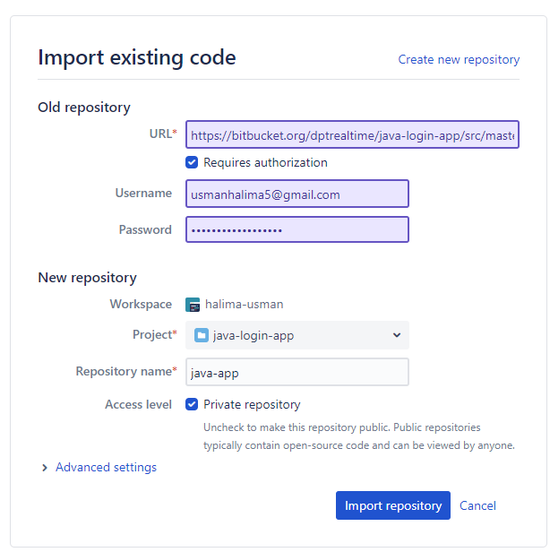

# Github-to-bitbucket-migration
## Migration Method1 
1. Clone GitHub repository
   ##### `git clone https://github.com/dptrealtime/java-login-app.git`

2. Clone Bitbucket repository as Developer1
   ##### `git clone https://migration-developer1@bitbucket.org/halima-usman/java-login-application.git`

3. Migrate the code from Github repository (local master) to Bitbucket repository (local master)
    ```cd java-login-app #cd into github repo
    git remote add bitbucket https://migration-developer1@bitbucket.org/halima-usman/java-login-application.git
    git pull origin master
    git push bitbucket master```

4. Follow branching strategy and commit the code to “feature” branch of Bitbucket repository.
    ```git checkout -b feature/FPG-100_migration
    git add .
    git commit -m "Add new feature"
    git push bitbucket feature/FPG-100_migration```

5. Raise Pull Request to merge the code from Feature branch to Master branch and add Developer2 as reviewer.
    

6. Login to Bitbucket as Developer2 then approve and merge the PR using “no fast forward”  merge strategy.
    

 ## Migration Method2 - using the Bitbucket UI
1. While viewing a project within Bitbucket click Import repository in the sidebar.
    
2. Select a source to import code from, provide the required information, then click Connect.
    a. For Bitbucket Cloud, include the Username and App password for the account (https://bitbucket.org/dptrealtime/java-login-app/src/master/) to import from, and ensure read access for account, team, project, and repository is enabled.
3. Choose which repositories to import.
    a. All repositories imports all the repositories owned by the account provided.
    b. Select repositories allows you choose specific repositories to import.
4. Click Import repository.


## Verification
1. Verify that the code is now showing in the Bitbucket repo.